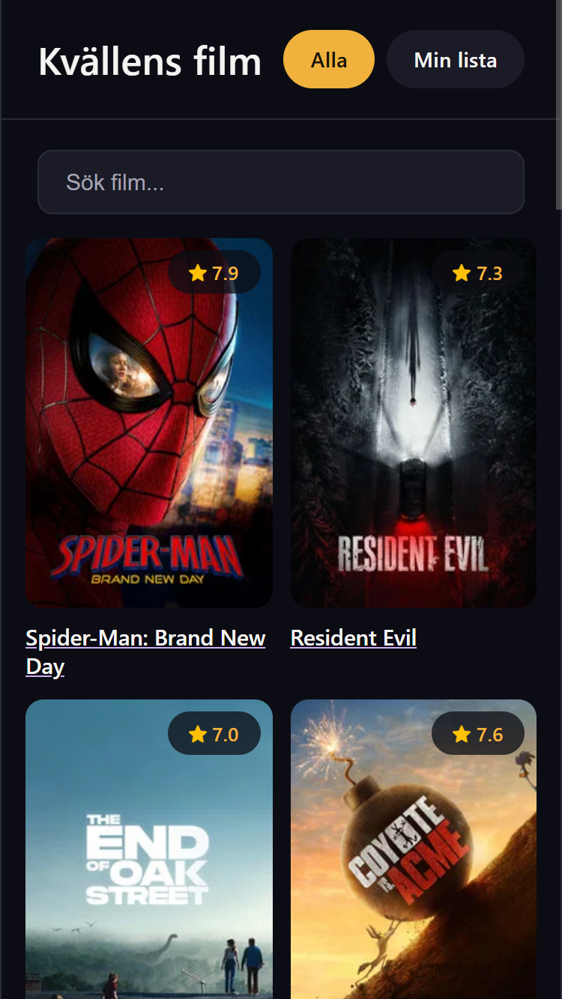
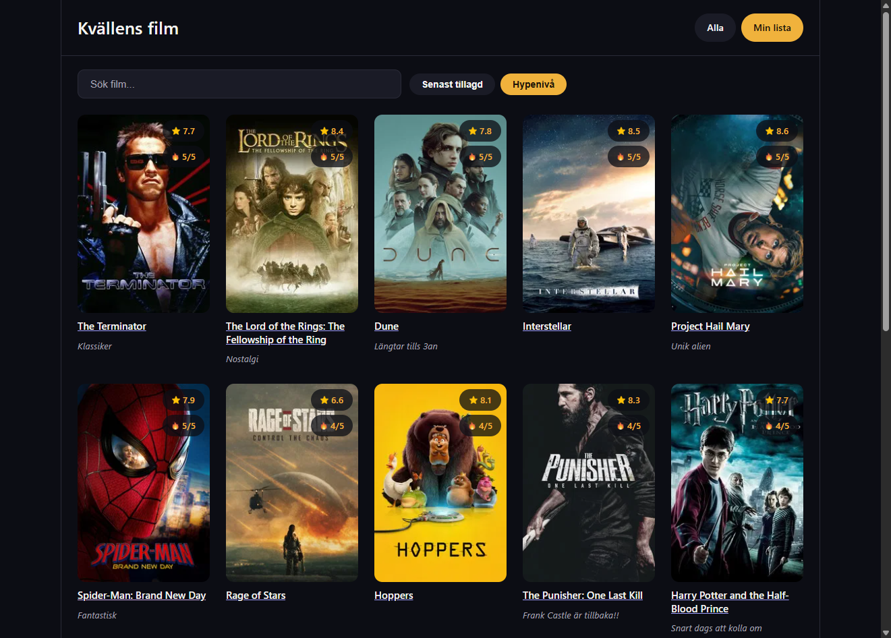

# Kvällens film

Kvällens film är en simpel filmapplikation byggd med React och TMDbs API. Användaren kan bläddra bland populära filmer eller söka efter en specifik titel, se detaljer och trailer för en film, och spara filmer till "Min lista" med en egen hypenivå (Hur taggad man är på att se filmen, 1-5) och anteckning. I "Min lista" kan man sedan söka bland sparade filmer och sortera dem efter senast tillagd eller hypenivå.


## Kör projektet lokalt

1. Installera dependencies:
   ```
   npm install
   ```
2. Skapa en .env-fil i projektroten baserad på .env.example, och lägg in din egen TMDb API token:
   ```
   VITE_TMDB_TOKEN=din-token-här
   ```
   Kräver kostnadsfri registrering på [TMDb](https://www.themoviedb.org/settings/api)

3. Starta dev servern med:
   ```
   npm run dev
   ```
   

## Uppfyllda krav
1. [X] Minst 5 komponenter med tydligt ansvar, rimlig mappstruktur.

   Komponenter: MovieCard, Navbar, SearchBar, TrailerButton, WatchlistButton, Pagination.
   
   Mappstruktur: components/, pages/, services/, hooks/, context/

2. [X] Routing mellan minst två vyer.

   Tre vyer: /, /movie/:id och /watchlist

3. [X] State delas mellan minst två komponenter.

   Delas genom context via WatchlistContext: WatchlistButton (lägger till eller tar bort) och WatchlistPage (visar listan) läser och skriver samma state.

   Delas även via props: HomePage skickar page till MovieCard, som använder det för att komma ihåg vilken sida användaren kom ifrån.

4. [X] Minst ett API-anrop med loading- och felhantering.

   API-anrop mot TMDb via en egen hook, useFetch, som används av HomePage och MovieDetailPage. Den hanterar loading (visar "Laddar...") och fel (visar felmeddelande om anropet misslyckas).

5. [X] Minst ett formulär med validering.

   Formulär i WatchlistButton: klickar man på "Lägg till i lista" knappen så visas ett formuler med "hypenivå" som är obligatorisk 1-5 och en valfri anteckning. Felmeddelande visas om du inte väljer en hypenivå utan att något sparas.

6. [X] Data lagras mellan sidladdningar.

   Sparad lista lagras i localstorage via useLocalStorage.

7. [X] Ren, namngiven och committad kod.

   Simpel namngivning och committad med rimlig historik.

8. [X] Komplett inlämning enligt ovan.

   Länk till GitHub-repo och denna README. [Deployad](https://kvallens-film.vercel.app/) med Vercel.

## VÄL GODKÄND (VG)

Minst tre av följande ska vara uppfyllda:

1. [X] Utökad felhantering: tydliga tomma-tillstånd, samt hantering av nätverksfel.

   Tomma-tillstånd: "Inga resultat hittades." vid sökning utan träffar (HomePage) och "Din lista är tom." när inga filmer sparats (WatchlistPage).

   Nätverksfel: useFetch fångar misslyckade API-anrop och visar ett felmeddelande istället för att krascha.

2. [X] Genomtänkt komponentarkitektur: återanvändbara komponenter, egna hooks för delad logik, tydlig separation mellan presentation och datahämtning.

   Återanvändbara komponenter: MovieCard och Pagination används i flera olika vyer. MovieCard tar emot valfria props (hypeLevel, note) så samma komponent kan visa både vanliga filmer och sparade filmer med hypenivå/anteckning.

   Egna hooks för delad logik: useWatchlist, useLocalStorage, useFetch, useMovies.

   Separation mellan presentation och datahämtning: useMovies innehåller all logik för att hämta filmer, så att HomePage själv bara hanterar state och rendering.

3. [X] Responsiv design: gränssnittet fungerar och ser bra ut även på mobil skärmstorlek.

   Sidan har anpassats för att fungera och se bra ut på mobil.

4. [X] (Tillräckligt?) Utökad funktionalitet utöver de gemensamma kraven, motiverad och relevant för idén.

   Sökfält och paginering i både homepage och "Min lista". I "Min lista" vyn finns även två sorteringsalternativ.
   Även en "Tillbaka" knapp i /movie/:id vyn som tar användaren tillbaka till rätt sida.

5. [X] Tydlig och väl underhållen commit-historik med beskrivande commit-meddelanden genom hela arbetet.

   18 commits med beskrivande meddelanden, gjorda löpande under arbetet.

## Skärmdumpar




